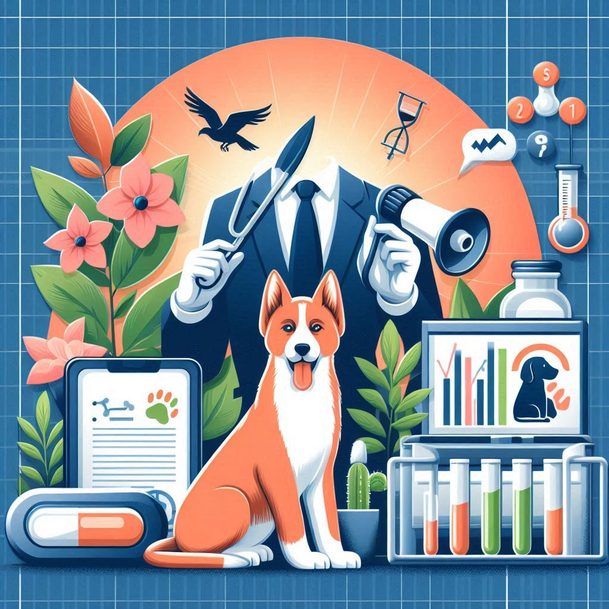
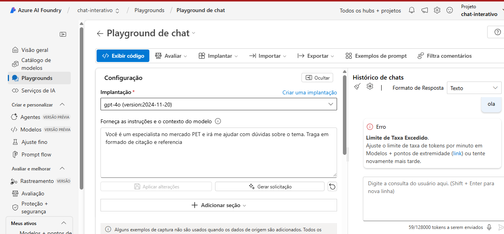

# Trabalho de Conclusão de Curso: Crescimento do Mercado Pet

## Sobre o Projeto
Este projeto tem como objetivo explorar o crescimento do mercado pet, abordando suas tendências, desafios e oportunidades. Utilizamos inteligência artificial para criar um chatbot capaz de responder perguntas com base no conteúdo de arquivos PDF relacionados ao tema.

## Funcionalidades
- Carregamento de arquivos PDF com informações sobre o mercado pet.
- Busca vetorial para indexar e recuperar dados relevantes dos PDFs.
- Geração de respostas contextuais com base nos documentos carregados.
- Chat interativo para facilitar a pesquisa e análise de dados.

## Estrutura do Repositório
- **assets**: Contém o logo do TCC e outras imagens relacionadas.
- **inputs**: Inclui os textos de entrada para testes e análises.
- **pdfs**: PDFS do contexto.

## Playground
Aqui está o código do sistema em execução:

